# 🛍️SQLiify 

[](https://www.python.org/downloads/)
[](https://streamlit.io/)
[](https://ai.google.dev/)
[](https://www.sqlite.org/)

> 🤖 **Transform natural language questions into SQL queries instantly!** This application uses Google's Gemini AI to convert your plain English questions about a clothes inventory database into executable SQL commands.

## 🎯 What This App Does

Ever wanted to query a database without writing SQL? This app lets you ask questions in plain English about a clothes inventory and automatically generates and executes the corresponding SQL queries!

**Example Interactions:**
- 🗣️ **You ask:** "How many shirts do we have in stock?"
- 🤖 **AI responds:** Executes `SELECT SUM(STOCK) FROM CLOTHES WHERE CATEGORY='Shirt'`
- 📊 **You get:** The actual count from your database!

## ✨ Features

- 🧠 **AI-Powered SQL Generation** - Uses Google Gemini Pro to convert natural language to SQL
- 🎨 **Beautiful Web Interface** - Built with Streamlit for an intuitive user experience  
- 📦 **Pre-loaded Sample Data** - Ready-to-use clothes inventory database
- 🔍 **Real-time Query Execution** - See results instantly
- 💬 **Natural Language Processing** - Ask questions like you're talking to a human

## 🗂️ Database Schema

The application works with a **CLOTHES** table containing:

| Column | Type | Description |
|--------|------|-------------|
| `ID` | INTEGER (Primary Key) | Unique identifier |
| `ITEM_NAME` | VARCHAR(50) | Name of the clothing item |
| `CATEGORY` | VARCHAR(30) | Type of clothing (Kurta, Shirt, etc.) |
| `PRICE` | INT | Price in rupees |
| `SIZE` | VARCHAR(10) | Size (S, M, L, XL, Free) |
| `STOCK` | INT | Available quantity |

### 📋 Sample Data
- Khadi Kurta (₹1200, M, Stock: 10)
- Cotton Saree (₹2500, Free Size, Stock: 5)
- Handloom Shirt (₹800, L, Stock: 15)
- Khadi Jacket (₹1800, XL, Stock: 7)
- Cotton Pants (₹1000, M, Stock: 12)

## 🚀 Quick Start Guide

### Prerequisites
- Python 3.8+
- Google AI API Key
- Basic understanding of databases (helpful but not required!)

### 1️⃣ Clone & Setup
```bash
# Clone the repository
git clone <https://github.com/techinbuddy09/-SQLiify->
cd  SQLiify 

# Install dependencies
pip install -r requirements.txt
```

### 2️⃣ Environment Setup
Create a `.env` file in your project root:
```env
GOOGLE_API_KEY=your_google_ai_api_key_here
```

**🔑 How to get your Google AI API Key:**
1. Visit [Google AI Studio](https://makersuite.google.com/app/apikey)
2. Sign in with your Google account
3. Click "Create API Key"
4. Copy and paste it into your `.env` file

### 3️⃣ Initialize Database
```bash
# Run the database setup script
python database_setup.py
```
This creates `clothes.db` with sample data.

### 4️⃣ Launch the App
```bash
streamlit run app.py
```

🎉 **That's it!** Your app will open in your browser at `http://localhost:8501`

## 💡 Example Queries You Can Try

| What You Can Ask | What It Does |
|------------------|--------------|
| "Show me all kurtas" | Lists all kurta items |
| "What's the most expensive item?" | Finds highest priced clothing |
| "How many items cost less than 1500?" | Counts affordable items |
| "Show me all XL size clothes" | Filters by size |
| "What's the total stock value?" | Calculates inventory worth |
| "Which category has the most items?" | Groups by category |

## 📁 Project Structure

```
📦  SQLiify 
├── 📄 app.py                 # Main Streamlit application
├── 📄 database_setup.py      # Database initialization script
├── 📄 requirements.txt       # Python dependencies
├── 📄 .env                   # Environment variables (create this)
├── 📄 clothes.db            # SQLite database (auto-generated)
└── 📄 README.md             # This file
```

## 🛠️ Dependencies Explained

```txt
streamlit              # Web app framework
google-generativeai    # Google Gemini AI integration
python-dotenv         # Environment variable management
langchain             # LLM framework utilities
sqlite3               # Database operations (built-in Python)
```

## 🎨 How It Works

```mermaid
graph LR
    A[👤 User Question] --> B[🤖 Gemini AI]
    B --> C[📝 SQL Query]
    C --> D[💾 SQLite Database]
    D --> E[📊 Results Display]
    E --> F[🖥️ Streamlit UI]
```



1. **User Input**: You type a question in natural language
2. **AI Processing**: Gemini AI converts your question to SQL
3. **Query Execution**: The SQL runs against your database
4. **Results Display**: Data is formatted and shown in the web interface

## 🔧 Customization Options

### Adding More Data
Edit `database_setup.py` to add more clothing items:
```python
cursor.execute('''INSERT INTO CLOTHES (ITEM_NAME, CATEGORY, PRICE, SIZE, STOCK) 
                VALUES ('Your Item', 'Category', price, 'size', stock)''')
```

### Modifying the AI Prompt
In `app.py`, customize the prompt to change how the AI interprets questions:
```python
prompt = [
    """
    Your custom instructions for the AI...
    Include examples and constraints here...
    """
]
```

### Styling the Interface
Add custom CSS in your Streamlit app:
```python
st.markdown("""
<style>
    /* Your custom styles here */
</style>
""", unsafe_allow_html=True)
```

## 🐛 Troubleshooting

### Common Issues & Solutions

**❌ "API Key not found" error**
- ✅ Make sure your `.env` file exists and contains `GOOGLE_API_KEY=your_key`
- ✅ Restart the application after adding the API key

**❌ "Database not found" error**
- ✅ Run `python database_setup.py` first
- ✅ Check if `clothes.db` file exists in your project directory

**❌ "Module not found" error**
- ✅ Run `pip install -r requirements.txt`
- ✅ Make sure you're in the correct virtual environment

**❌ Streamlit won't start**
- ✅ Check if port 8501 is available
- ✅ Try `streamlit run app.py --server.port 8502`

## 🚀 Future Enhancements

- [ ] 📱 Mobile-responsive design
- [ ] 📊 Data visualization with charts
- [ ] 🔐 User authentication system
- [ ] 📤 Export results to CSV/PDF
- [ ] 🔄 Database backup and restore
- [ ] 🌍 Multi-language support
- [ ] 📈 Query history and favorites
- [ ] 🤖 Voice input support

## 🤝 Contributing

We love contributions! Here's how you can help:

1. 🍴 Fork the repository
2. 🌟 Create a feature branch (`git checkout -b amazing-feature`)
3. 💾 Commit your changes (`git commit -m 'Add amazing feature'`)
4. 📤 Push to the branch (`git push origin amazing-feature`)
5. 🎯 Open a Pull Request

## 📜 License

This project is licensed under the MIT License - see the [LICENSE](LICENSE) file for details.

## 🙏 Acknowledgments

- 🤖 **Google AI** for the powerful Gemini model
- 🎨 **Streamlit** for the amazing web app framework
- 🐍 **Python Community** for the excellent libraries
- 💡 **You** for using and improving this project!

## 📞 Support

Having issues or questions? We're here to help!

- 📧 **Email**: techinbuddy815@gmail.com,anusha859695@hmail.com
- 💬 **Issues**: [GitHub Issues](https://github.com/techinbuddy09/-SQLiify-/issues)
- 📖 **Documentation**: Check the code comments and this README

---

<div align="center">

### 🌟 Don't forget to star this repository if it helped you! 🌟

**Made with ❤️ and 🤖 AI**

</div>
